# Kan Bağı

Kan bağışı ihtiyaçlarını duyuran, bağışçıları bilgilendiren ve teşvik eden açık kaynaklı bir mobil uygulama.
Bağışın gerçekleştiği **doğrulanmaz**; amaç farkındalık yaratmak ve ilanları ilgili kişilere ulaştırmaktır.

### Uygulama Ekranları

| Ana Ekran | İlan Detayı | İlan Ver | Harita | Mesajlar |
| :---: | :---: | :---: | :---: | :---: |
| 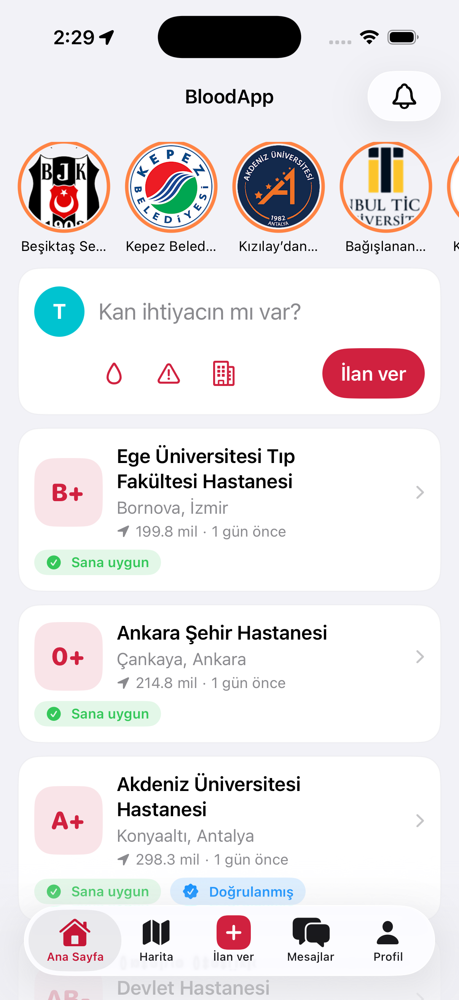 | 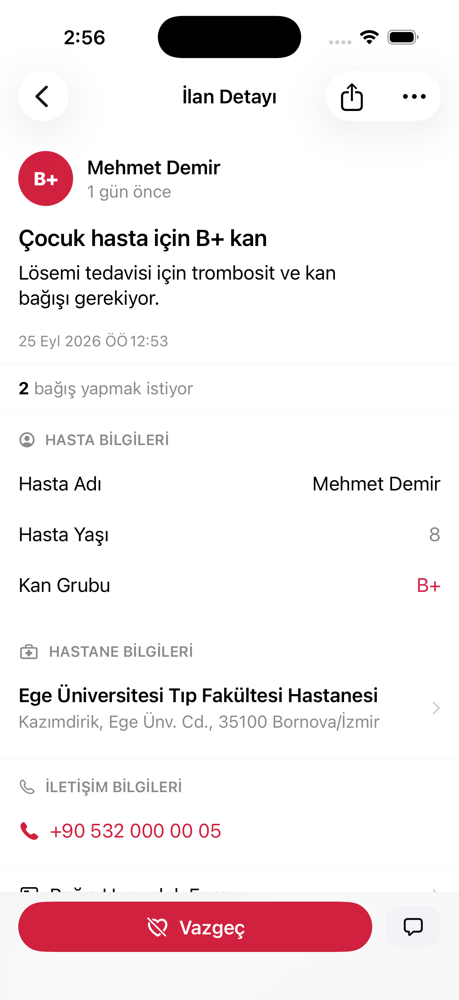 | 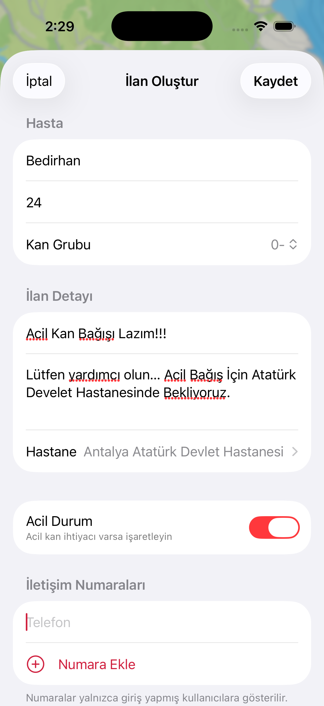 | 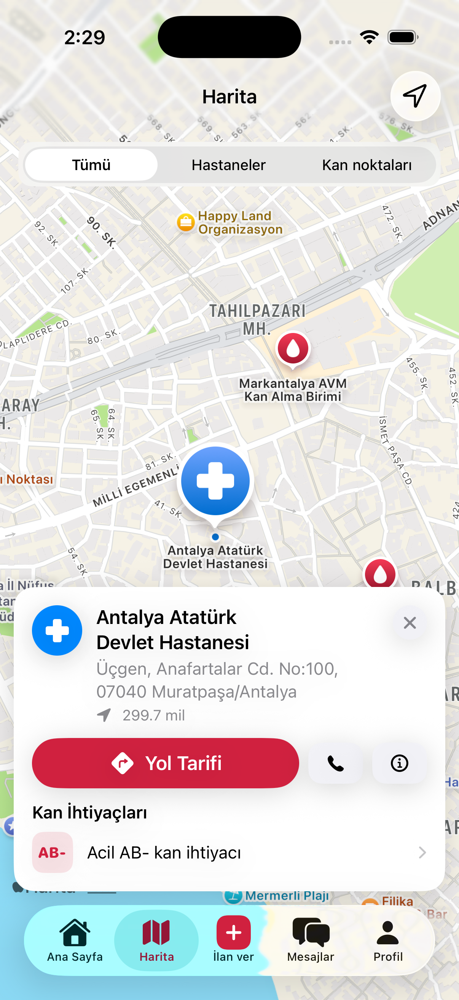 | 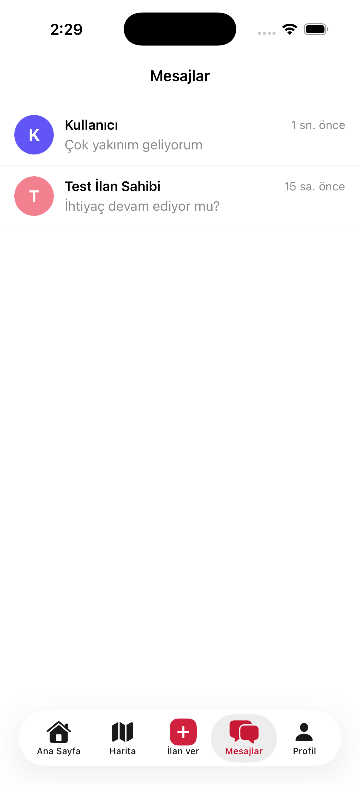 |

| Bildirimler | Ayarlar | Profil | Bağışçı Formu | Giriş |
| :---: | :---: | :---: | :---: | :---: |
| 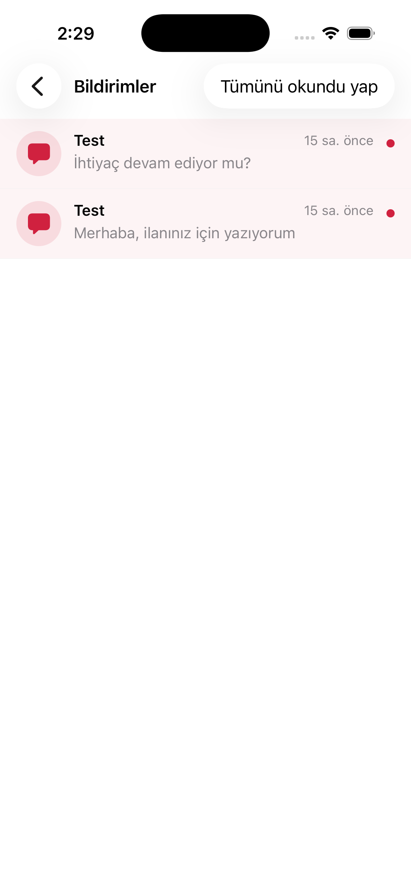 | 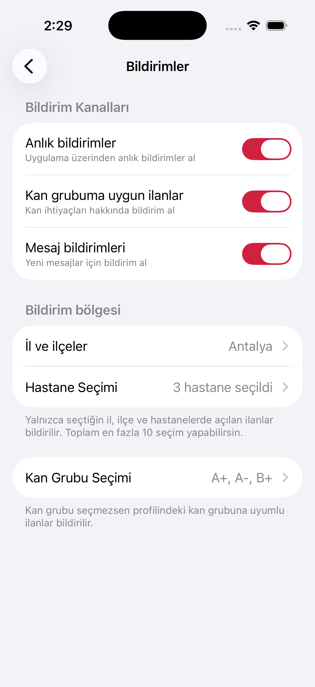 | 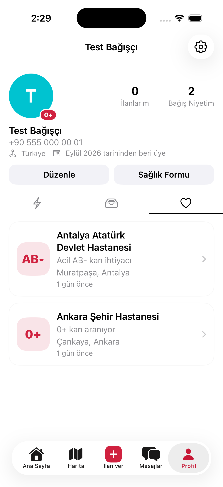 | 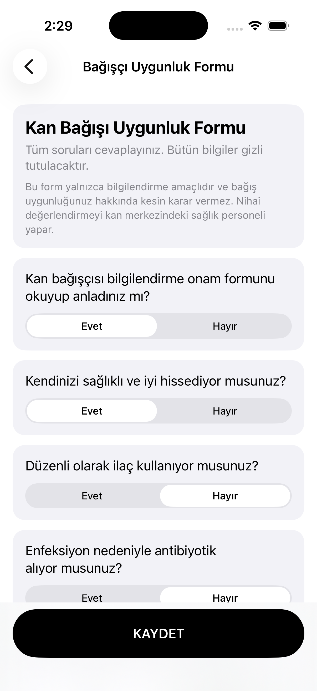 | 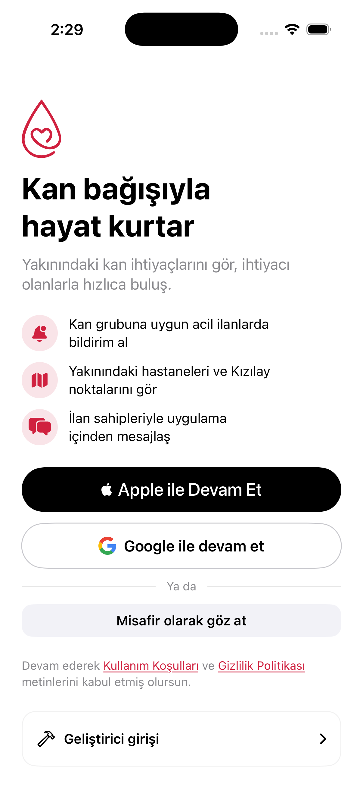 |

| Adım 1 (Bilgiler) | Adım 2 (Kan Grubu) | Adım 3 (Konum) | Adım 4 (Onay) |
| :---: | :---: | :---: | :---: |
| 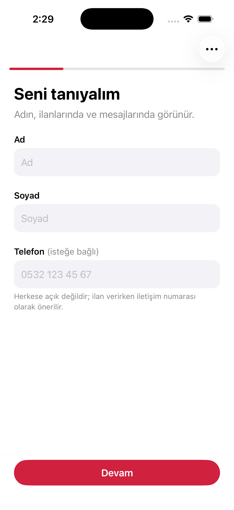 | 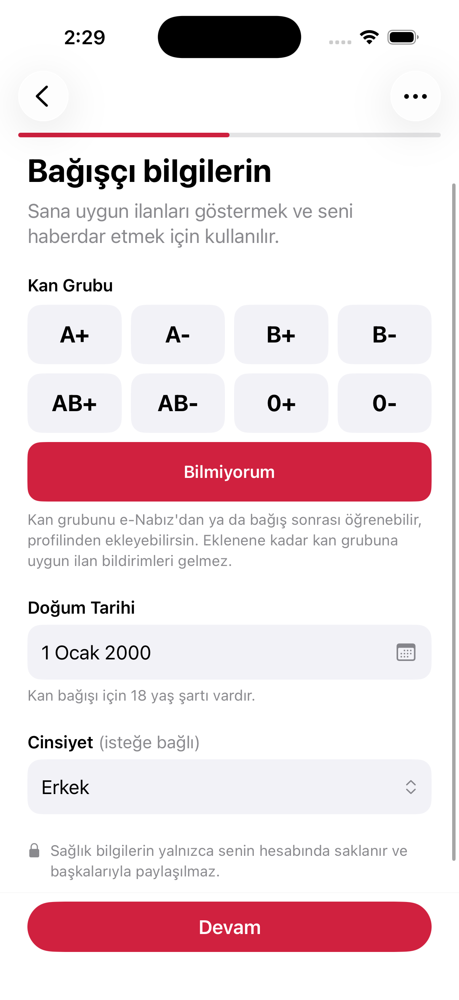 | 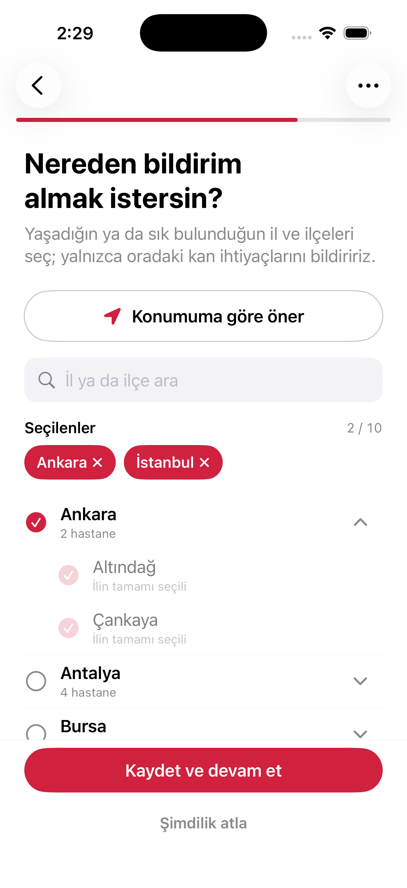 | 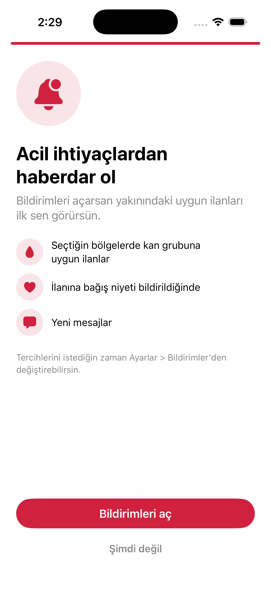 |

---

> Bu depo Android ve iOS uygulamalarını ve ortak backend'i (Supabase) içerir.

| Klasör | İçerik | Durum |
|---|---|---|
| [`donate-blood-ios/`](donate-blood-ios/donateblood/README.md) | **Native SwiftUI iOS uygulaması** (iOS 16+), Clean Architecture, Supabase | Güncel, test edilmiş |
| [`supabase/`](supabase/README.md) | Veritabanı şeması + RLS, yamalar, örnek veri, test kullanıcıları, `send-push` Edge Function | Güncel |
| [`donate-blood-android/`](donate-blood-android/README.md) | Jetpack Compose Android uygulaması | **Eski (legacy):** mikroservis backend'ine bağlıdır, Supabase'e henüz taşınmadı. Referans arayüz olarak durur |
| [`docs/`](docs/) | Push bildirimleri (OneSignal) kurulumu | |

## Hızlı başlangıç (iOS, Apple/Google hesabı gerekmez)

1. Ücretsiz bir [Supabase](https://supabase.com) projesi açın ve [`supabase/README.md`](supabase/README.md) adımlarını uygulayın.
2. `donate-blood-ios/donateblood/Config/Secrets.example.xcconfig` dosyasını `Secrets.xcconfig` olarak kopyalayıp Supabase URL ve anon key'inizi yazın.
3. Xcode'da açıp çalıştırın; giriş ekranındaki **"Geliştirici girişi"** bölümünde bir test hesabına dokunun (yazmanız gerekmez).
   Kayıt akışını görmek için **"Yeni kullanıcı (kayıt)"** hesabını seçin.

Ayrıntılar: [CONTRIBUTING.md](CONTRIBUTING.md).

## Özellikler
- Tüm kan gruplarındaki ilanlar, kullanıcıya en yakın hastaneden en uzağa sıralı
- İlan oluşturma, "bağış yapmak istiyorum" bildirimi, hastane haritası, uygulama içi mesajlaşma
- Bağışçı uygunluk formu (bilgilendirme amaçlı)
- Misafir modu (salt okunur), Apple/Google girişi, kan grubuna ve seçilen il/ilçe/hastanelere göre push bildirimi
- Türkçe ve İngilizce

## Lisans ve atıf
[Apache License 2.0](LICENSE). Kullanabilir, değiştirebilir, çatallayabilir ve yayınlayabilirsiniz;
[NOTICE](NOTICE) dosyasındaki atıf metnini korumanız gerekir (ör. README'nizde veya uygulamanızın "Hakkında" ekranında).
Örnek veri ve dış görseller lisansa dahil değildir; ayrıntı için [NOTICE](NOTICE).

## Topluluk
[Katkı rehberi](CONTRIBUTING.md) · [Davranış kuralları](CODE_OF_CONDUCT.md) · [Güvenlik politikası](SECURITY.md)