<div align="center">
  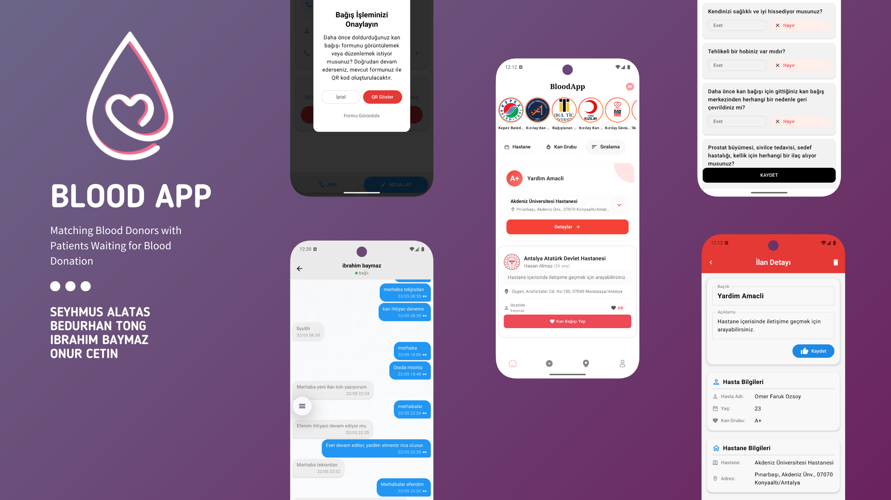
  <h1>Blood App</h1>
  <p>
    <strong>This project is the Android (Kotlin/Jetpack Compose) client for a blood donation application built with a **microservice architecture**. The app communicates with separate backend microservices for each functional domain via REST API and WebSocket.
</strong>
  </p>
</div>

## Setup (secrets)
API keys and signing credentials are **not** in the repository. Copy `local.properties.example` to
`local.properties` (git-ignored) and fill in `MAPS_API_KEY`, optionally `CONTENTFUL_*` and the `RELEASE_*`
signing values. `google-services.json` files are also git-ignored; add your own Firebase config.

## Architecture Overview
- **Microservice Backend:** Each functional domain (user, matching, chat, post, notification, etc.) is implemented as a separate backend service.
- **Android Client:** Each microservice has a corresponding Kotlin module and Retrofit API interface.
- **Dependency Injection:** Hilt is used for managing dependencies between modules.
- **Reactive UI:** Modern, reactive user interfaces are built with Jetpack Compose.

---

## System Architecture Diagram

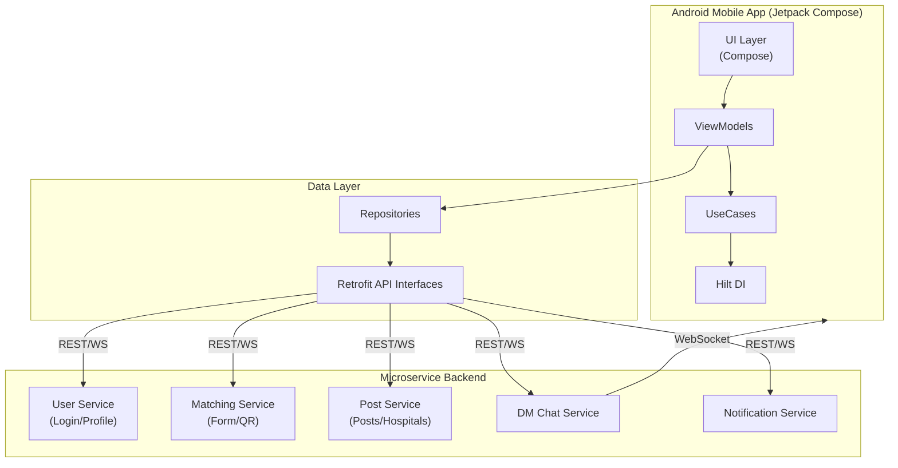

---

## Modules and API Endpoints
Below are the main modules of the application and a summary of their related API endpoints. Endpoint prefixes are organized by domain, in line with microservice principles.

### 1. Matching Microservice
- **Purpose:** Blood donation eligibility form operations and donor-patient matching (including QR code verification)
- **API:** `FormApi.kt`, `QrApi.kt`
- **Endpoint Prefix:** `evaluation-form/`, `matching/`
- **Examples:**
  - `PUT evaluation-form/updateForm` — Update form
  - `POST evaluation-form/createForm` — Create form
  - `GET evaluation-form/questions` — Get question list
  - `GET evaluation-form/getForm` — Get user form
  - `POST matching/create` — Create matching and QR code
  - `POST matching/validate` — Validate matching via QR

### 2. Post Microservice
- **Purpose:** Blood donation posts management and hospital operations
- **API:** `HomeApi.kt`, `HospitalApi.kt`
- **Endpoint Prefix:** `Post/`, `aggregate/`, `Hospital/`
- **Examples:**
  - `GET Post/get-all-posts` — Get all posts
  - `GET Post/get-post` — Get single post details
  - `DELETE Post/delete-post` — Delete post
  - `PUT Post/update-post` — Update post
  - `POST Post/set-post-activeness` — Set post active/inactive
  - `GET aggregate/user/{userId}/posts` — Get posts donated by user
  - `GET Hospital/get-all-hospitals` — Get all hospitals
  - `GET Hospital/get-hospital` — Get single hospital details

### 3. DM Chat Microservice
- **Purpose:** Direct messaging between users
- **API:** `DmApi.kt`
- **Endpoint Prefix:** `chat/`
- **Examples:**
  - `POST chat/create-room` — Create new chat room
  - `GET chat/get-rooms-by-user-id` — Get user's chat rooms
  - `GET chat/get-messages-by-room-id` — Get room messages (paginated)
  - **WebSocket:** `ws://<host>:8000/chat/ws/{roomId}/{userId}` — Real-time messaging

### 4. User Microservice
- **Purpose:** Authentication and profile management
- **API:** `LoginApi.kt`, `ProfileApi.kt`
- **Endpoint Prefix:** `Profile/`, `profile/`
- **Examples:**
  - `GET Profile/is-profile-completed` — Is profile completed?
  - `POST profile/complete-profile` — Complete profile
  - `GET Profile/get-session-info` — Get session info
  - `GET Profile/get-user-info` — Get user profile info

### 5. Notification Microservice
- **Purpose:** Notification preferences and application settings
- **API:** `SettingsApi.kt`
- **Endpoint Prefix:** `Profile/`
- **Examples:**
  - `POST Profile/set-notification-preferences` — Set notification preferences
  - `GET Profile/get-notification-preferences` — Get notification preferences

## Project Structure
```
app/src/main/java/com/ribuufing/bloodapp/feature/
  ├── form/           # Form operations
  ├── home/           # Blood donation posts
  ├── postdetail/     # QR and matching
  ├── dmchat/         # Direct messaging
  ├── logintype/      # Login and profile
  ├── profile/        # Profile management
  ├── listhospitals/  # Hospitals
  ├── settings/       # Notification and settings
```

## Dependencies
- **Retrofit:** REST API communication
- **OkHttp:** HTTP client
- **Hilt:** Dependency Injection
- **Jetpack Compose:** UI
- **Paging, Navigation, CameraX, MLKit:** Modern Android components


## Screenshots

| login | home | story |
|:-:|:-:|:-:|
| 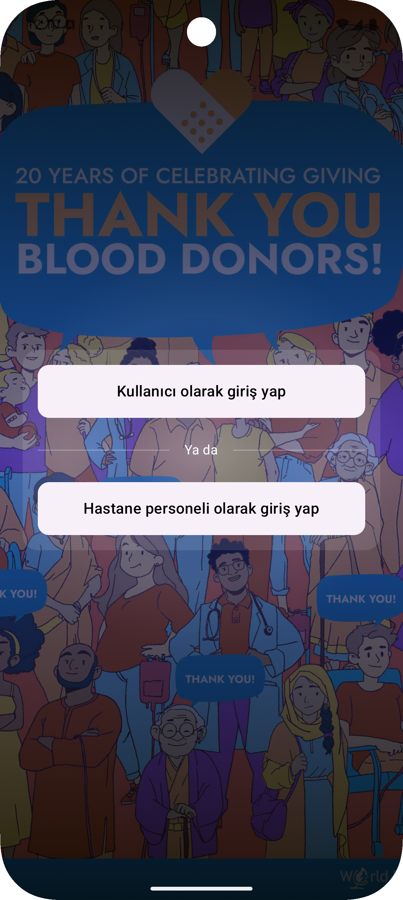 | 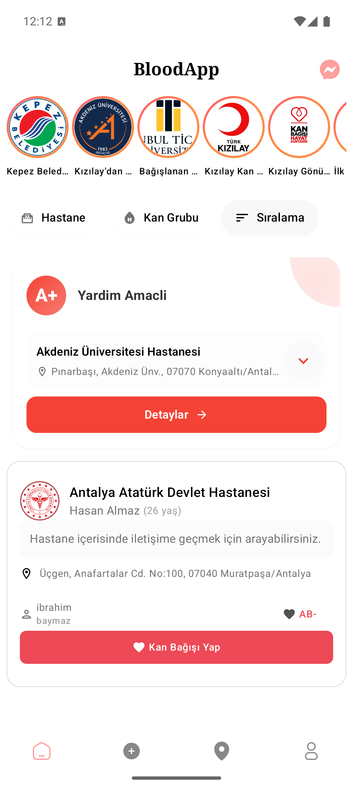 | 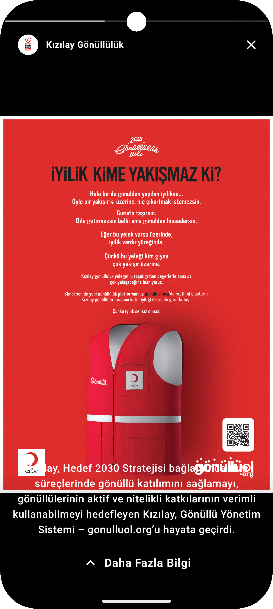 |
| post | qr | form |
| 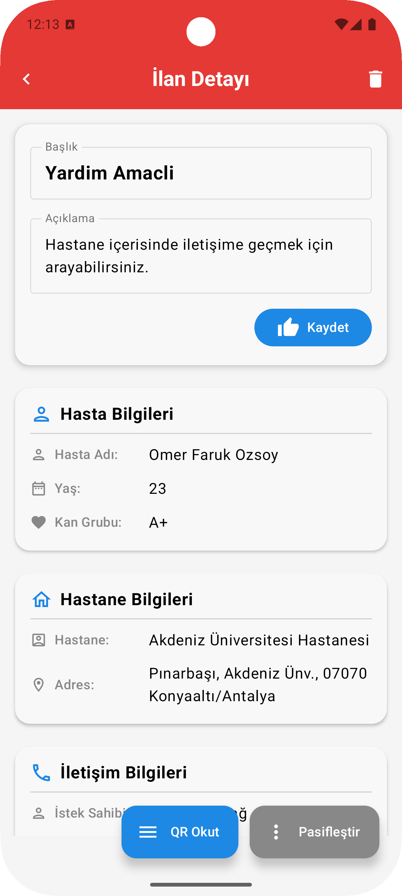 | 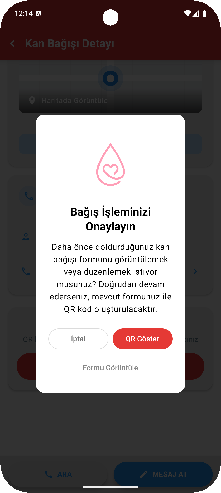 | 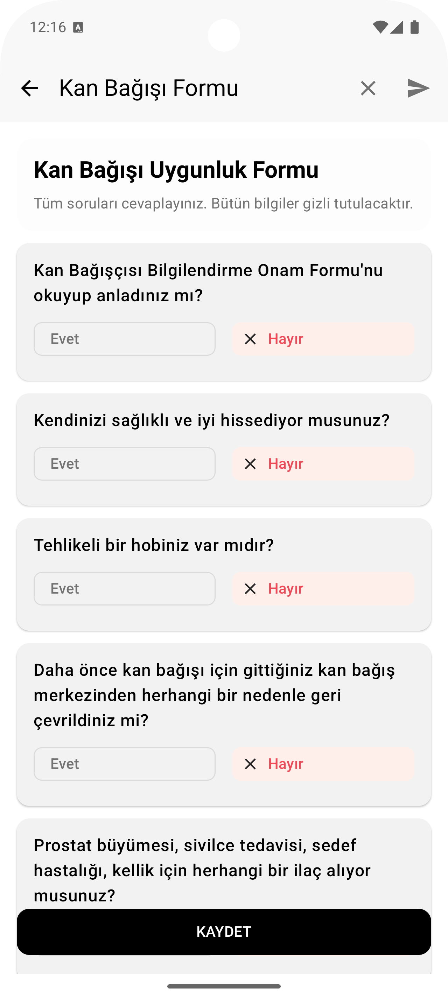 
| map | chat | chat detail |
| 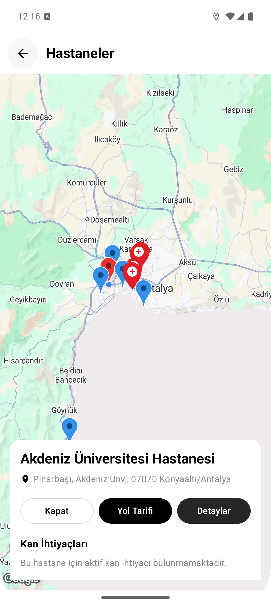 | 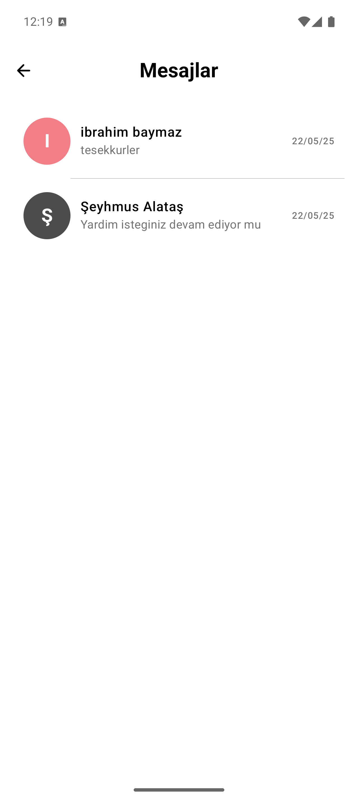 | 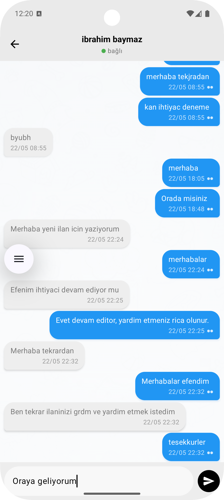 

